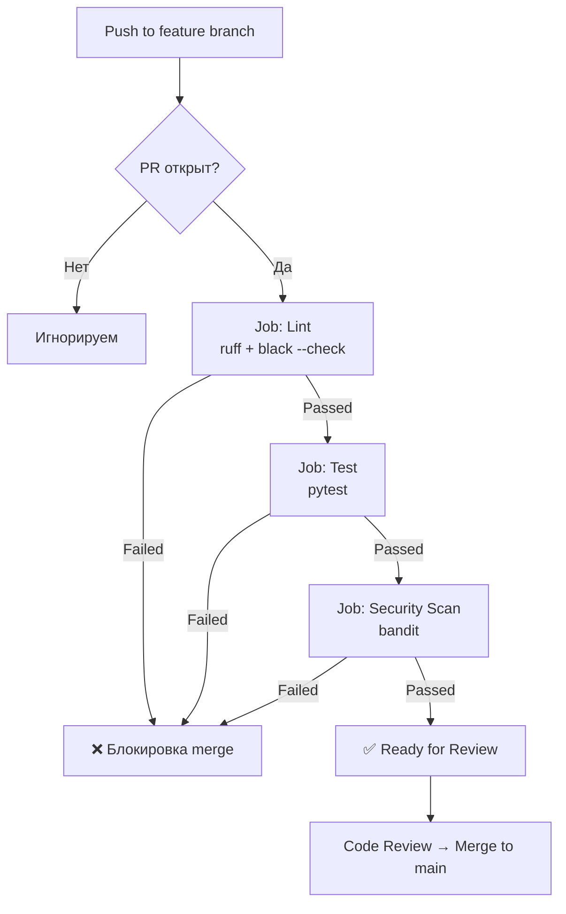

# Логика CI-пайплайна (Fast Feedback Loop)

## Описание

Пайплайн запускается автоматически при каждом открытии или обновлении Pull Request в ветку `main`.  
Цель — дать разработчику быструю обратную связь о качестве кода до code review.

---

## Схема пайплайна



---

## Конфигурация GitHub Actions

Файл: `.github/workflows/ci.yml`

```yaml
name: CI Pipeline

on:
  pull_request:
    branches: [ main ]

jobs:
  lint:
    name: Lint
    runs-on: ubuntu-latest
    steps:
      - uses: actions/checkout@v4

      - name: Set up Python
        uses: actions/setup-python@v5
        with:
          python-version: '3.12'

      - name: Install dependencies
        run: |
          pip install ruff black

      - name: Run ruff
        run: ruff check .

      - name: Check formatting with black
        run: black --check .

  test:
    name: Test
    runs-on: ubuntu-latest
    needs: lint
    steps:
      - uses: actions/checkout@v4

      - name: Set up Python
        uses: actions/setup-python@v5
        with:
          python-version: '3.12'

      - name: Install dependencies
        run: |
          pip install pytest httpx fastapi

      - name: Run tests
        run: pytest tests/ -v

  security:
    name: Security Scan
    runs-on: ubuntu-latest
    needs: test
    steps:
      - uses: actions/checkout@v4

      - name: Set up Python
        uses: actions/setup-python@v5
        with:
          python-version: '3.12'

      - name: Install bandit
        run: pip install bandit

      - name: Run bandit
        run: bandit -r app/ -ll
```

---

## Описание этапов

### Lint
Запускается первым. Проверяет стиль кода (`ruff`) и форматирование (`black`).  
Если линтер падает — следующие этапы не запускаются, экономя время и ресурсы.

### Test
Запускается только если Lint прошёл. Выполняет unit-тесты через `pytest`.  
Покрывает базовую логику: генерацию short_code, валидацию URL, подсчёт переходов.

### Security Scan
Финальный этап. `bandit` анализирует код на типичные уязвимости Python:  
инъекции, небезопасные функции, жёстко прописанные секреты.

---

## Влияние на процесс

| Метрика                        | До (VSM 201)     | После           |
|-------------------------------|------------------|-----------------|
| Время проверки кода            | 20–30 мин вручную | ~3 мин авто    |
| Обнаружение ошибок             | На code review   | До code review  |
| Блокировка плохого кода        | Нет              | Автоматически   |
