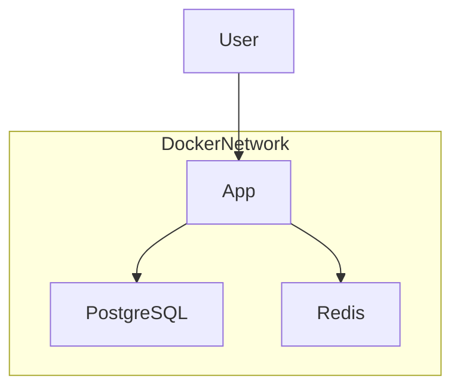

# Схема взаимодействия контейнеров

## Описание

Все контейнеры работают во внутренней сети Docker.

Приложение взаимодействует с PostgreSQL для хранения данных и с Redis для кэширования запросов.

Данные PostgreSQL сохраняются через Docker Volume.
