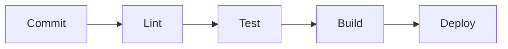
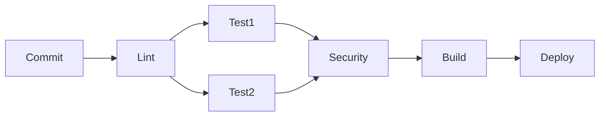

# VSM карта

## AS-IS

```mermaid
graph LR

Commit --> Lint
Lint --> Test
Test --> Build
Build --> Deploy
```

Узкие места:

* Test (8 мин)
* Build (6 мин)

## TO-BE

```mermaid
graph LR

Commit --> Lint

Lint --> Test1
Lint --> Test2

Test1 --> Security
Test2 --> Security

Security --> Build

Build --> Deploy
```

Решения:

1. Параллельное тестирование.
2. Кэширование зависимостей.
3. Docker Build Cache.
